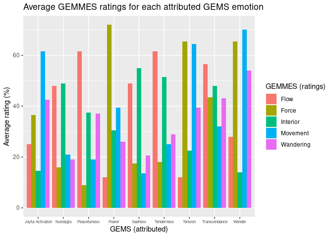

Data Practical 5
================
Stefano Politi
(21 juin 2022)

-   [Importing Data](#importing-data)
-   [Transforming Data](#transforming-data)
-   [Plotting Data](#plotting-data)
-   [References](#references)

Required packages:

``` r
library(readxl)
library(knitr)
library(dplyr)
library(tidyr)
library(ggplot2)
```

## Importing Data

The following dataset is described
[here](https://github.com/StefPo21/IntroDataScience/tree/main/3_data/2_Data.md#Importing-External-Data)
(Dataset 2).

``` r
GEMMES <- read_xlsx("Exp2A-GEMMES_Binomial.xlsx", sheet = 1)
```

The dataset contains multiple copies for each participant. For the
purpose of this practice, the duplicates will be removed.

``` r
GEMMES_clean <- GEMMES %>%
  select(-VISU, -VISU_Value, -VISU_Binomial)
GEMMES_clean <- unique(GEMMES_clean)
```

The dataset contains many variables. For the purpose of this practice,
only a subset will be selected.

``` r
GEMMES2 <- GEMMES_clean %>%
  select(Sex, Age, Musician_type, Excerpt_id, Excerpt_GEMS, 79:97)
kable(head(GEMMES2, 10))
```

| Sex | Age | Musician_type | Excerpt_id               | Excerpt_GEMS     | BEST_GEMS             | GEMS_JoyfulActivation | GEMS_Nostalgia | GEMS_Peacefulness | GEMS_Power | GEMS_Sadness | GEMS_Tenderness | GEMS_Tension | GEMS_Transcendence | GEMS_Wonder | BEST_VA    | VA_Arousal | VA_Valence | BEST_VISU     | VISU_Flow | VISU_Force | VISU_Interior | VISU_Movement | VISU_Wandering |
|:----|----:|--------------:|:-------------------------|:-----------------|:----------------------|----------------------:|---------------:|------------------:|-----------:|-------------:|----------------:|-------------:|-------------------:|------------:|:-----------|-----------:|-----------:|:--------------|----------:|-----------:|--------------:|--------------:|---------------:|
| M   |  28 |             3 | bach_brandenburgconcerto | Sadness          | GEMS_Nostalgia        |                     8 |             48 |                28 |         14 |           47 |              35 |            7 |                 25 |          26 | VA_Arousal |         48 |         34 | VISU_Flow     |        55 |         22 |            49 |            24 |             27 |
| M   |  28 |             3 | bach_goldberg            | Tenderness       | GEMS_Tenderness       |                    29 |             52 |                61 |          3 |           25 |              63 |            0 |                 20 |          41 | VA_Valence |         47 |         69 | VISU_Flow     |        63 |         12 |            43 |            26 |             29 |
| M   |  28 |             3 | bach_passacaglia         | Power            | GEMS_Power            |                     3 |             22 |                 9 |         59 |           44 |               1 |           25 |                 36 |           5 | VA_Arousal |         61 |         13 | VISU_Force    |        15 |         66 |            44 |             9 |             11 |
| M   |  28 |             3 | bach_prelude19inamajor   | Peacefulness     | GEMS_Tenderness       |                    29 |             48 |                57 |          6 |           17 |              60 |            3 |                 17 |          34 | VA_Valence |         36 |         67 | VISU_Flow     |        60 |         10 |            34 |            19 |             34 |
| M   |  28 |             3 | bach_preludeincminor     | Tension          | GEMS_Tension          |                    39 |             25 |                 7 |         49 |           14 |              15 |           50 |                 27 |          31 | VA_Valence |         52 |         57 | VISU_Movement |        22 |         56 |            27 |            65 |             45 |
| M   |  28 |             3 | bach_preludio            | JoyfulActivation | GEMS_JoyfulActivation |                    65 |              9 |                17 |         38 |            2 |              15 |           46 |                 21 |          57 | VA_Valence |         61 |         77 | VISU_Movement |        24 |         45 |            13 |            65 |             42 |
| M   |  28 |             3 | beethoven_violindmajor   | Wonder           | GEMS_Power            |                    57 |              6 |                10 |         69 |            1 |               9 |           57 |                 34 |          51 | VA_Valence |         68 |         75 | VISU_Movement |        33 |         63 |            12 |            70 |             54 |
| M   |  28 |             3 | bruch_violin1gminor      | Wonder           | GEMS_Power            |                    28 |             54 |                24 |         61 |           31 |              39 |           25 |                 35 |          56 | VA_Arousal |         78 |         62 | VISU_Movement |        23 |         68 |            16 |            70 |             54 |
| M   |  28 |             3 | buxtehude_allegro        | JoyfulActivation | GEMS_JoyfulActivation |                    67 |              8 |                21 |         21 |            3 |              23 |           20 |                 11 |          55 | VA_Valence |         45 |         71 | VISU_Movement |        26 |         28 |            16 |            58 |             43 |
| M   |  28 |             3 | geminiani_adagio         | Nostalgia        | GEMS_Nostalgia        |                    14 |             54 |                37 |         16 |           35 |              37 |            5 |                 24 |          29 | VA_Valence |         46 |         49 | VISU_Flow     |        48 |         19 |            41 |            32 |             25 |

## Transforming Data

Transforming the dataset from wide to long format:

``` r
GEMMES2_long <- gather(GEMMES2, condition, measurement, VISU_Flow:VISU_Wandering)
kable(head(GEMMES2_long, 10))
```

| Sex | Age | Musician_type | Excerpt_id               | Excerpt_GEMS     | BEST_GEMS             | GEMS_JoyfulActivation | GEMS_Nostalgia | GEMS_Peacefulness | GEMS_Power | GEMS_Sadness | GEMS_Tenderness | GEMS_Tension | GEMS_Transcendence | GEMS_Wonder | BEST_VA    | VA_Arousal | VA_Valence | BEST_VISU     | condition | measurement |
|:----|----:|--------------:|:-------------------------|:-----------------|:----------------------|----------------------:|---------------:|------------------:|-----------:|-------------:|----------------:|-------------:|-------------------:|------------:|:-----------|-----------:|-----------:|:--------------|:----------|------------:|
| M   |  28 |             3 | bach_brandenburgconcerto | Sadness          | GEMS_Nostalgia        |                     8 |             48 |                28 |         14 |           47 |              35 |            7 |                 25 |          26 | VA_Arousal |         48 |         34 | VISU_Flow     | VISU_Flow |          55 |
| M   |  28 |             3 | bach_goldberg            | Tenderness       | GEMS_Tenderness       |                    29 |             52 |                61 |          3 |           25 |              63 |            0 |                 20 |          41 | VA_Valence |         47 |         69 | VISU_Flow     | VISU_Flow |          63 |
| M   |  28 |             3 | bach_passacaglia         | Power            | GEMS_Power            |                     3 |             22 |                 9 |         59 |           44 |               1 |           25 |                 36 |           5 | VA_Arousal |         61 |         13 | VISU_Force    | VISU_Flow |          15 |
| M   |  28 |             3 | bach_prelude19inamajor   | Peacefulness     | GEMS_Tenderness       |                    29 |             48 |                57 |          6 |           17 |              60 |            3 |                 17 |          34 | VA_Valence |         36 |         67 | VISU_Flow     | VISU_Flow |          60 |
| M   |  28 |             3 | bach_preludeincminor     | Tension          | GEMS_Tension          |                    39 |             25 |                 7 |         49 |           14 |              15 |           50 |                 27 |          31 | VA_Valence |         52 |         57 | VISU_Movement | VISU_Flow |          22 |
| M   |  28 |             3 | bach_preludio            | JoyfulActivation | GEMS_JoyfulActivation |                    65 |              9 |                17 |         38 |            2 |              15 |           46 |                 21 |          57 | VA_Valence |         61 |         77 | VISU_Movement | VISU_Flow |          24 |
| M   |  28 |             3 | beethoven_violindmajor   | Wonder           | GEMS_Power            |                    57 |              6 |                10 |         69 |            1 |               9 |           57 |                 34 |          51 | VA_Valence |         68 |         75 | VISU_Movement | VISU_Flow |          33 |
| M   |  28 |             3 | bruch_violin1gminor      | Wonder           | GEMS_Power            |                    28 |             54 |                24 |         61 |           31 |              39 |           25 |                 35 |          56 | VA_Arousal |         78 |         62 | VISU_Movement | VISU_Flow |          23 |
| M   |  28 |             3 | buxtehude_allegro        | JoyfulActivation | GEMS_JoyfulActivation |                    67 |              8 |                21 |         21 |            3 |              23 |           20 |                 11 |          55 | VA_Valence |         45 |         71 | VISU_Movement | VISU_Flow |          26 |
| M   |  28 |             3 | geminiani_adagio         | Nostalgia        | GEMS_Nostalgia        |                    14 |             54 |                37 |         16 |           35 |              37 |            5 |                 24 |          29 | VA_Valence |         46 |         49 | VISU_Flow     | VISU_Flow |          48 |

Uniting columns concerning participant information (sex, age and
musician type):

``` r
GEMMES2_long <- GEMMES2_long %>%
  unite(Participant_info, Sex, Age, Musician_type)
kable(head(GEMMES2_long, 10))
```

| Participant_info | Excerpt_id               | Excerpt_GEMS     | BEST_GEMS             | GEMS_JoyfulActivation | GEMS_Nostalgia | GEMS_Peacefulness | GEMS_Power | GEMS_Sadness | GEMS_Tenderness | GEMS_Tension | GEMS_Transcendence | GEMS_Wonder | BEST_VA    | VA_Arousal | VA_Valence | BEST_VISU     | condition | measurement |
|:-----------------|:-------------------------|:-----------------|:----------------------|----------------------:|---------------:|------------------:|-----------:|-------------:|----------------:|-------------:|-------------------:|------------:|:-----------|-----------:|-----------:|:--------------|:----------|------------:|
| M_28_3           | bach_brandenburgconcerto | Sadness          | GEMS_Nostalgia        |                     8 |             48 |                28 |         14 |           47 |              35 |            7 |                 25 |          26 | VA_Arousal |         48 |         34 | VISU_Flow     | VISU_Flow |          55 |
| M_28_3           | bach_goldberg            | Tenderness       | GEMS_Tenderness       |                    29 |             52 |                61 |          3 |           25 |              63 |            0 |                 20 |          41 | VA_Valence |         47 |         69 | VISU_Flow     | VISU_Flow |          63 |
| M_28_3           | bach_passacaglia         | Power            | GEMS_Power            |                     3 |             22 |                 9 |         59 |           44 |               1 |           25 |                 36 |           5 | VA_Arousal |         61 |         13 | VISU_Force    | VISU_Flow |          15 |
| M_28_3           | bach_prelude19inamajor   | Peacefulness     | GEMS_Tenderness       |                    29 |             48 |                57 |          6 |           17 |              60 |            3 |                 17 |          34 | VA_Valence |         36 |         67 | VISU_Flow     | VISU_Flow |          60 |
| M_28_3           | bach_preludeincminor     | Tension          | GEMS_Tension          |                    39 |             25 |                 7 |         49 |           14 |              15 |           50 |                 27 |          31 | VA_Valence |         52 |         57 | VISU_Movement | VISU_Flow |          22 |
| M_28_3           | bach_preludio            | JoyfulActivation | GEMS_JoyfulActivation |                    65 |              9 |                17 |         38 |            2 |              15 |           46 |                 21 |          57 | VA_Valence |         61 |         77 | VISU_Movement | VISU_Flow |          24 |
| M_28_3           | beethoven_violindmajor   | Wonder           | GEMS_Power            |                    57 |              6 |                10 |         69 |            1 |               9 |           57 |                 34 |          51 | VA_Valence |         68 |         75 | VISU_Movement | VISU_Flow |          33 |
| M_28_3           | bruch_violin1gminor      | Wonder           | GEMS_Power            |                    28 |             54 |                24 |         61 |           31 |              39 |           25 |                 35 |          56 | VA_Arousal |         78 |         62 | VISU_Movement | VISU_Flow |          23 |
| M_28_3           | buxtehude_allegro        | JoyfulActivation | GEMS_JoyfulActivation |                    67 |              8 |                21 |         21 |            3 |              23 |           20 |                 11 |          55 | VA_Valence |         45 |         71 | VISU_Movement | VISU_Flow |          26 |
| M_28_3           | geminiani_adagio         | Nostalgia        | GEMS_Nostalgia        |                    14 |             54 |                37 |         16 |           35 |              37 |            5 |                 24 |          29 | VA_Valence |         46 |         49 | VISU_Flow     | VISU_Flow |          48 |

Reverting the previous operation, thus separating columns concerning
participant information (sex, age and musician type):

``` r
GEMMES2_long <- GEMMES2_long %>%
    separate(Participant_info, into=c("Sex", "Age", "Musician_type"), sep ="_")
kable(head(GEMMES2_long, 10))
```

| Sex | Age | Musician_type | Excerpt_id               | Excerpt_GEMS     | BEST_GEMS             | GEMS_JoyfulActivation | GEMS_Nostalgia | GEMS_Peacefulness | GEMS_Power | GEMS_Sadness | GEMS_Tenderness | GEMS_Tension | GEMS_Transcendence | GEMS_Wonder | BEST_VA    | VA_Arousal | VA_Valence | BEST_VISU     | condition | measurement |
|:----|:----|:--------------|:-------------------------|:-----------------|:----------------------|----------------------:|---------------:|------------------:|-----------:|-------------:|----------------:|-------------:|-------------------:|------------:|:-----------|-----------:|-----------:|:--------------|:----------|------------:|
| M   | 28  | 3             | bach_brandenburgconcerto | Sadness          | GEMS_Nostalgia        |                     8 |             48 |                28 |         14 |           47 |              35 |            7 |                 25 |          26 | VA_Arousal |         48 |         34 | VISU_Flow     | VISU_Flow |          55 |
| M   | 28  | 3             | bach_goldberg            | Tenderness       | GEMS_Tenderness       |                    29 |             52 |                61 |          3 |           25 |              63 |            0 |                 20 |          41 | VA_Valence |         47 |         69 | VISU_Flow     | VISU_Flow |          63 |
| M   | 28  | 3             | bach_passacaglia         | Power            | GEMS_Power            |                     3 |             22 |                 9 |         59 |           44 |               1 |           25 |                 36 |           5 | VA_Arousal |         61 |         13 | VISU_Force    | VISU_Flow |          15 |
| M   | 28  | 3             | bach_prelude19inamajor   | Peacefulness     | GEMS_Tenderness       |                    29 |             48 |                57 |          6 |           17 |              60 |            3 |                 17 |          34 | VA_Valence |         36 |         67 | VISU_Flow     | VISU_Flow |          60 |
| M   | 28  | 3             | bach_preludeincminor     | Tension          | GEMS_Tension          |                    39 |             25 |                 7 |         49 |           14 |              15 |           50 |                 27 |          31 | VA_Valence |         52 |         57 | VISU_Movement | VISU_Flow |          22 |
| M   | 28  | 3             | bach_preludio            | JoyfulActivation | GEMS_JoyfulActivation |                    65 |              9 |                17 |         38 |            2 |              15 |           46 |                 21 |          57 | VA_Valence |         61 |         77 | VISU_Movement | VISU_Flow |          24 |
| M   | 28  | 3             | beethoven_violindmajor   | Wonder           | GEMS_Power            |                    57 |              6 |                10 |         69 |            1 |               9 |           57 |                 34 |          51 | VA_Valence |         68 |         75 | VISU_Movement | VISU_Flow |          33 |
| M   | 28  | 3             | bruch_violin1gminor      | Wonder           | GEMS_Power            |                    28 |             54 |                24 |         61 |           31 |              39 |           25 |                 35 |          56 | VA_Arousal |         78 |         62 | VISU_Movement | VISU_Flow |          23 |
| M   | 28  | 3             | buxtehude_allegro        | JoyfulActivation | GEMS_JoyfulActivation |                    67 |              8 |                21 |         21 |            3 |              23 |           20 |                 11 |          55 | VA_Valence |         45 |         71 | VISU_Movement | VISU_Flow |          26 |
| M   | 28  | 3             | geminiani_adagio         | Nostalgia        | GEMS_Nostalgia        |                    14 |             54 |                37 |         16 |           35 |              37 |            5 |                 24 |          29 | VA_Valence |         46 |         49 | VISU_Flow     | VISU_Flow |          48 |

## Plotting Data

The aim of this section is to plot participant ratings of musical
metaphors (GEMMES) against musical emotions (GEMS) previously attributed
to each excerpt.

To do so, the first step is to calculate the average ratings of each
metaphor for each emotion.

``` r
GEMMES2_table <- GEMMES2 %>%
  group_by(Excerpt_GEMS) %>%
  summarize(mean_Flow = mean(VISU_Flow), mean_Force = mean(VISU_Force), mean_Interior = mean(VISU_Interior), mean_Movement = mean(VISU_Movement), mean_Wandering = mean(VISU_Wandering))
GEMMES2_table_long <- gather(GEMMES2_table, condition, measurement, mean_Flow:mean_Wandering)
kable(head(GEMMES2_long, 10))
```

| Sex | Age | Musician_type | Excerpt_id               | Excerpt_GEMS     | BEST_GEMS             | GEMS_JoyfulActivation | GEMS_Nostalgia | GEMS_Peacefulness | GEMS_Power | GEMS_Sadness | GEMS_Tenderness | GEMS_Tension | GEMS_Transcendence | GEMS_Wonder | BEST_VA    | VA_Arousal | VA_Valence | BEST_VISU     | condition | measurement |
|:----|:----|:--------------|:-------------------------|:-----------------|:----------------------|----------------------:|---------------:|------------------:|-----------:|-------------:|----------------:|-------------:|-------------------:|------------:|:-----------|-----------:|-----------:|:--------------|:----------|------------:|
| M   | 28  | 3             | bach_brandenburgconcerto | Sadness          | GEMS_Nostalgia        |                     8 |             48 |                28 |         14 |           47 |              35 |            7 |                 25 |          26 | VA_Arousal |         48 |         34 | VISU_Flow     | VISU_Flow |          55 |
| M   | 28  | 3             | bach_goldberg            | Tenderness       | GEMS_Tenderness       |                    29 |             52 |                61 |          3 |           25 |              63 |            0 |                 20 |          41 | VA_Valence |         47 |         69 | VISU_Flow     | VISU_Flow |          63 |
| M   | 28  | 3             | bach_passacaglia         | Power            | GEMS_Power            |                     3 |             22 |                 9 |         59 |           44 |               1 |           25 |                 36 |           5 | VA_Arousal |         61 |         13 | VISU_Force    | VISU_Flow |          15 |
| M   | 28  | 3             | bach_prelude19inamajor   | Peacefulness     | GEMS_Tenderness       |                    29 |             48 |                57 |          6 |           17 |              60 |            3 |                 17 |          34 | VA_Valence |         36 |         67 | VISU_Flow     | VISU_Flow |          60 |
| M   | 28  | 3             | bach_preludeincminor     | Tension          | GEMS_Tension          |                    39 |             25 |                 7 |         49 |           14 |              15 |           50 |                 27 |          31 | VA_Valence |         52 |         57 | VISU_Movement | VISU_Flow |          22 |
| M   | 28  | 3             | bach_preludio            | JoyfulActivation | GEMS_JoyfulActivation |                    65 |              9 |                17 |         38 |            2 |              15 |           46 |                 21 |          57 | VA_Valence |         61 |         77 | VISU_Movement | VISU_Flow |          24 |
| M   | 28  | 3             | beethoven_violindmajor   | Wonder           | GEMS_Power            |                    57 |              6 |                10 |         69 |            1 |               9 |           57 |                 34 |          51 | VA_Valence |         68 |         75 | VISU_Movement | VISU_Flow |          33 |
| M   | 28  | 3             | bruch_violin1gminor      | Wonder           | GEMS_Power            |                    28 |             54 |                24 |         61 |           31 |              39 |           25 |                 35 |          56 | VA_Arousal |         78 |         62 | VISU_Movement | VISU_Flow |          23 |
| M   | 28  | 3             | buxtehude_allegro        | JoyfulActivation | GEMS_JoyfulActivation |                    67 |              8 |                21 |         21 |            3 |              23 |           20 |                 11 |          55 | VA_Valence |         45 |         71 | VISU_Movement | VISU_Flow |          26 |
| M   | 28  | 3             | geminiani_adagio         | Nostalgia        | GEMS_Nostalgia        |                    14 |             54 |                37 |         16 |           35 |              37 |            5 |                 24 |          29 | VA_Valence |         46 |         49 | VISU_Flow     | VISU_Flow |          48 |

Now, a grouped barplot can be created, visuualizing the average metaphor
ratings for each attributed emotion.

``` r
ggplot(GEMMES2_table_long, aes(x=Excerpt_GEMS, y=measurement, fill = condition))+
  geom_bar(position='dodge', stat='identity')+
  theme(axis.text.x = element_text(size = 6))+
  scale_x_discrete(labels = c("Joyful Activation", "Nostalgia", "Peacefulness", "Power", "Sadness", "Tenderness", "Tension", "Transcendance", "Wonder"))+
  labs(title = "Average GEMMES ratings for each attributed GEMS emotion", x="GEMS (attributed)", y="Average rating (%)", fill = "GEMMES (ratings)")+
  scale_fill_discrete(labels = c("Flow", "Force", "Interior", "Movement", "Wandering"))
```

<!-- -->

## References

Schaerlaeken, S., Glowinski, D., & Grandjean, D. (2022). Linking musical
metaphors and emotions evoked by the sound of classical music.
*Psychology of music*, 50(1), 245-264.
