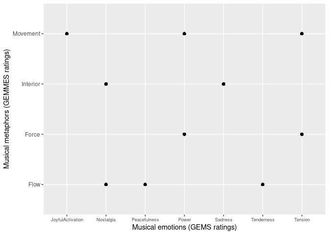

Data Practical 4
================
Stefano Politi
(20 juin 2022)

-   [Importing Data](#importing-data)
-   [Transforming Data](#transforming-data)
-   [Plotting Data](#plotting-data)
-   [References](#references)

Required packages:

``` r
library(readxl)
library(knitr)
library(dplyr)
library(tidyr)
library(ggplot2)
```

## Importing Data

The following dataset is described
[here](https://github.com/StefPo21/IntroDataScience/tree/main/3_data/2_Data.md#Importing-External-Data)
(Dataset 2).

``` r
GEMMES <- read_xlsx("Exp2A-GEMMES_Binomial.xlsx", sheet = 1)
```

The dataset contains multiple copies for each participant. For the
purpose of this practice, the duplicates will be removed.

``` r
GEMMES_clean <- GEMMES %>%
  select(-VISU, -VISU_Value, -VISU_Binomial)
GEMMES_clean <- unique(GEMMES_clean)
```

The dataset contains many variables. For the purpose of this practice,
only a subset will be selected.

``` r
GEMMES2 <- GEMMES_clean %>%
  select(Sex, Age, Musician_type, Excerpt_id, Excerpt_GEMS, BEST_GEMS, BEST_VA, BEST_VISU)
kable(head(GEMMES2, 10))
```

| Sex | Age | Musician_type | Excerpt_id               | Excerpt_GEMS     | BEST_GEMS             | BEST_VA    | BEST_VISU     |
|:----|----:|--------------:|:-------------------------|:-----------------|:----------------------|:-----------|:--------------|
| M   |  28 |             3 | bach_brandenburgconcerto | Sadness          | GEMS_Nostalgia        | VA_Arousal | VISU_Flow     |
| M   |  28 |             3 | bach_goldberg            | Tenderness       | GEMS_Tenderness       | VA_Valence | VISU_Flow     |
| M   |  28 |             3 | bach_passacaglia         | Power            | GEMS_Power            | VA_Arousal | VISU_Force    |
| M   |  28 |             3 | bach_prelude19inamajor   | Peacefulness     | GEMS_Tenderness       | VA_Valence | VISU_Flow     |
| M   |  28 |             3 | bach_preludeincminor     | Tension          | GEMS_Tension          | VA_Valence | VISU_Movement |
| M   |  28 |             3 | bach_preludio            | JoyfulActivation | GEMS_JoyfulActivation | VA_Valence | VISU_Movement |
| M   |  28 |             3 | beethoven_violindmajor   | Wonder           | GEMS_Power            | VA_Valence | VISU_Movement |
| M   |  28 |             3 | bruch_violin1gminor      | Wonder           | GEMS_Power            | VA_Arousal | VISU_Movement |
| M   |  28 |             3 | buxtehude_allegro        | JoyfulActivation | GEMS_JoyfulActivation | VA_Valence | VISU_Movement |
| M   |  28 |             3 | geminiani_adagio         | Nostalgia        | GEMS_Nostalgia        | VA_Valence | VISU_Flow     |

## Transforming Data

Transforming the dataset from wide to long format:

``` r
GEMMES2_long <- gather(GEMMES2, condition, measurement, BEST_GEMS:BEST_VISU)
kable(head(GEMMES2_long, 10))
```

| Sex | Age | Musician_type | Excerpt_id               | Excerpt_GEMS     | condition | measurement           |
|:----|----:|--------------:|:-------------------------|:-----------------|:----------|:----------------------|
| M   |  28 |             3 | bach_brandenburgconcerto | Sadness          | BEST_GEMS | GEMS_Nostalgia        |
| M   |  28 |             3 | bach_goldberg            | Tenderness       | BEST_GEMS | GEMS_Tenderness       |
| M   |  28 |             3 | bach_passacaglia         | Power            | BEST_GEMS | GEMS_Power            |
| M   |  28 |             3 | bach_prelude19inamajor   | Peacefulness     | BEST_GEMS | GEMS_Tenderness       |
| M   |  28 |             3 | bach_preludeincminor     | Tension          | BEST_GEMS | GEMS_Tension          |
| M   |  28 |             3 | bach_preludio            | JoyfulActivation | BEST_GEMS | GEMS_JoyfulActivation |
| M   |  28 |             3 | beethoven_violindmajor   | Wonder           | BEST_GEMS | GEMS_Power            |
| M   |  28 |             3 | bruch_violin1gminor      | Wonder           | BEST_GEMS | GEMS_Power            |
| M   |  28 |             3 | buxtehude_allegro        | JoyfulActivation | BEST_GEMS | GEMS_JoyfulActivation |
| M   |  28 |             3 | geminiani_adagio         | Nostalgia        | BEST_GEMS | GEMS_Nostalgia        |

Uniting columns concerning participant information (sex, age and
musician type):

``` r
GEMMES2_long <- GEMMES2_long %>%
  unite(Participant_info, Sex, Age, Musician_type)
kable(head(GEMMES2_long, 10))
```

| Participant_info | Excerpt_id               | Excerpt_GEMS     | condition | measurement           |
|:-----------------|:-------------------------|:-----------------|:----------|:----------------------|
| M_28_3           | bach_brandenburgconcerto | Sadness          | BEST_GEMS | GEMS_Nostalgia        |
| M_28_3           | bach_goldberg            | Tenderness       | BEST_GEMS | GEMS_Tenderness       |
| M_28_3           | bach_passacaglia         | Power            | BEST_GEMS | GEMS_Power            |
| M_28_3           | bach_prelude19inamajor   | Peacefulness     | BEST_GEMS | GEMS_Tenderness       |
| M_28_3           | bach_preludeincminor     | Tension          | BEST_GEMS | GEMS_Tension          |
| M_28_3           | bach_preludio            | JoyfulActivation | BEST_GEMS | GEMS_JoyfulActivation |
| M_28_3           | beethoven_violindmajor   | Wonder           | BEST_GEMS | GEMS_Power            |
| M_28_3           | bruch_violin1gminor      | Wonder           | BEST_GEMS | GEMS_Power            |
| M_28_3           | buxtehude_allegro        | JoyfulActivation | BEST_GEMS | GEMS_JoyfulActivation |
| M_28_3           | geminiani_adagio         | Nostalgia        | BEST_GEMS | GEMS_Nostalgia        |

Reverting the previous operation, thus separating columns concerning
participant information (sex, age and musician type):

``` r
GEMMES2_long <- GEMMES2_long %>%
    separate(Participant_info, into=c("Sex", "Age", "Musician_type"), sep ="_")
kable(head(GEMMES2_long, 10))
```

| Sex | Age | Musician_type | Excerpt_id               | Excerpt_GEMS     | condition | measurement           |
|:----|:----|:--------------|:-------------------------|:-----------------|:----------|:----------------------|
| M   | 28  | 3             | bach_brandenburgconcerto | Sadness          | BEST_GEMS | GEMS_Nostalgia        |
| M   | 28  | 3             | bach_goldberg            | Tenderness       | BEST_GEMS | GEMS_Tenderness       |
| M   | 28  | 3             | bach_passacaglia         | Power            | BEST_GEMS | GEMS_Power            |
| M   | 28  | 3             | bach_prelude19inamajor   | Peacefulness     | BEST_GEMS | GEMS_Tenderness       |
| M   | 28  | 3             | bach_preludeincminor     | Tension          | BEST_GEMS | GEMS_Tension          |
| M   | 28  | 3             | bach_preludio            | JoyfulActivation | BEST_GEMS | GEMS_JoyfulActivation |
| M   | 28  | 3             | beethoven_violindmajor   | Wonder           | BEST_GEMS | GEMS_Power            |
| M   | 28  | 3             | bruch_violin1gminor      | Wonder           | BEST_GEMS | GEMS_Power            |
| M   | 28  | 3             | buxtehude_allegro        | JoyfulActivation | BEST_GEMS | GEMS_JoyfulActivation |
| M   | 28  | 3             | geminiani_adagio         | Nostalgia        | BEST_GEMS | GEMS_Nostalgia        |

## Plotting Data

Plot of music excerpt ratings for musical emotions (x-axis) against
musical mataphors (y-axis):

``` r
ggplot(GEMMES2, aes(BEST_GEMS, BEST_VISU))+
  geom_point()+
  theme(axis.text.x = element_text(size = 7))+
  labs(x = "Musical emotions (GEMS ratings)", y = "Musical metaphors (GEMMES ratings)")+
  scale_y_discrete(labels = c("Flow", "Force", "Interior", "Movement"))+
  scale_x_discrete(labels = c("JoyfulActivation", "Nostalgia", "Peacefulness", "Power", "Sadness", "Tenderness", "Tension"))
```

<!-- -->

## References

Schaerlaeken, S., Glowinski, D., & Grandjean, D. (2022). Linking musical
metaphors and emotions evoked by the sound of classical music.
*Psychology of music*, 50(1), 245-264.
