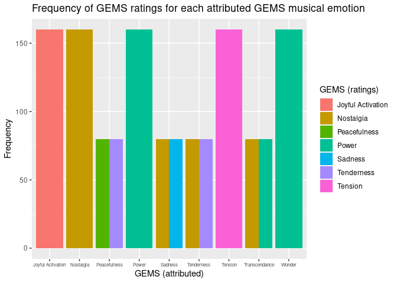
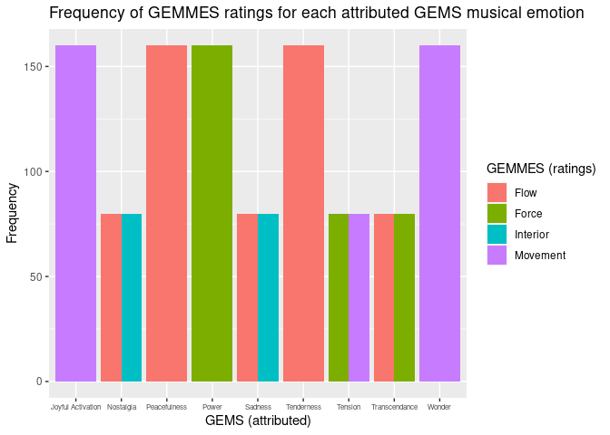
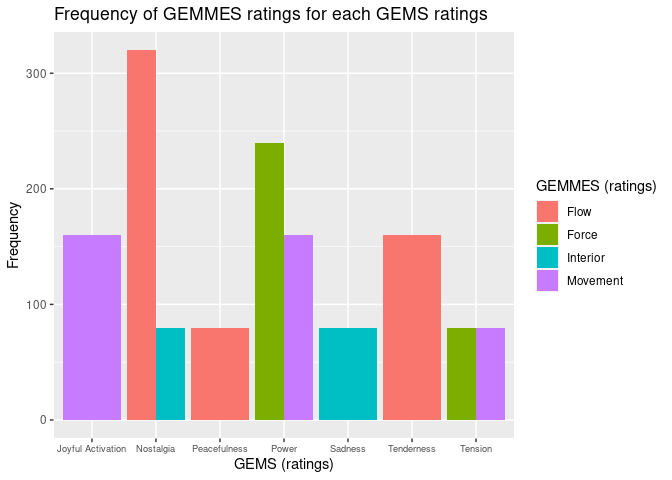

Data Practical 5
================
Stefano Politi
(20 juin 2022)

-   [Importing Data](#importing-data)
-   [Research questions](#research-questions)
-   [Plotting Data](#plotting-data)
-   [References](#references)

Required packages:

``` r
library(readxl)
library(knitr)
library(dplyr)
library(tidyr)
library(ggplot2)
```

## Importing Data

The following dataset is described
[here](https://github.com/StefPo21/IntroDataScience/tree/main/3_data/2_Data.md#Importing-External-Data)
(Dataset 2).

``` r
GEMMES <- read_xlsx("Exp2A-GEMMES_Binomial.xlsx", sheet = 1)
```

The dataset contains multiple copies for each participant. For the
purpose of this practice, the duplicates will be removed.

``` r
GEMMES_clean <- GEMMES %>%
  select(-VISU, -VISU_Value, -VISU_Binomial)
GEMMES_clean <- unique(GEMMES_clean)
```

The dataset contains many variables. For the purpose of this practice,
only a subset will be selected.

``` r
GEMMES2 <- GEMMES_clean %>%
  select(Sex, Age, Musician_type, Excerpt_id, Excerpt_GEMS, BEST_GEMS, BEST_VA, BEST_VISU)
kable(head(GEMMES2, 10))
```

| Sex | Age | Musician_type | Excerpt_id               | Excerpt_GEMS     | BEST_GEMS             | BEST_VA    | BEST_VISU     |
|:----|----:|--------------:|:-------------------------|:-----------------|:----------------------|:-----------|:--------------|
| M   |  28 |             3 | bach_brandenburgconcerto | Sadness          | GEMS_Nostalgia        | VA_Arousal | VISU_Flow     |
| M   |  28 |             3 | bach_goldberg            | Tenderness       | GEMS_Tenderness       | VA_Valence | VISU_Flow     |
| M   |  28 |             3 | bach_passacaglia         | Power            | GEMS_Power            | VA_Arousal | VISU_Force    |
| M   |  28 |             3 | bach_prelude19inamajor   | Peacefulness     | GEMS_Tenderness       | VA_Valence | VISU_Flow     |
| M   |  28 |             3 | bach_preludeincminor     | Tension          | GEMS_Tension          | VA_Valence | VISU_Movement |
| M   |  28 |             3 | bach_preludio            | JoyfulActivation | GEMS_JoyfulActivation | VA_Valence | VISU_Movement |
| M   |  28 |             3 | beethoven_violindmajor   | Wonder           | GEMS_Power            | VA_Valence | VISU_Movement |
| M   |  28 |             3 | bruch_violin1gminor      | Wonder           | GEMS_Power            | VA_Arousal | VISU_Movement |
| M   |  28 |             3 | buxtehude_allegro        | JoyfulActivation | GEMS_JoyfulActivation | VA_Valence | VISU_Movement |
| M   |  28 |             3 | geminiani_adagio         | Nostalgia        | GEMS_Nostalgia        | VA_Valence | VISU_Flow     |

## Research questions

Did the musical emotions (GEMS) which were pre-attributed to each
musical excerpt correspond to the participant’s ratings of the musical
emotions (GEMS)?

Which musical metaphors (GEMMES) ratings are best correlated with either
the attributed or the rated musical emotions (GEMMES)?

## Plotting Data

The plot of musical emotions (GEMS) ratings for each attributed musical
emotion (GEMS) shows the following correlations:

-   Joyful Activation, Nostalgia, Power, Tension and Wonder ratings show
    a frequency of 100% for their respective prior attributions.
-   Peacefulness, Sadness, Tenderness and Transcendence show a frequency
    of 50% for their respective prior attributions.
    -   Peacefulness shows a frequency of 50% also for Tenderness
        ratings.
    -   Sadness, Tenderness and Transcendence show a frequency of 50%
        also for Nostalgia ratings.

Note: The ratings used for the following visualizations are only the
highest ratings of each participant for each music excerpt. They do not
take into consideration all other participant’s ratings (which might be
very close to the best). For example an excerpt might be rated, on a
scale from 0 to 100, as 65 Sadness and 64 Nostalgia, but only Sadness
will be counted as most representative of the excerpt for this
participant.

``` r
GEMMES2_table <- GEMMES2 %>%
  count(var=GEMMES2$Excerpt_GEMS, wt_var = GEMMES2$BEST_GEMS)
ggplot(GEMMES2_table, aes(x=var, y=n, fill = wt_var))+
  geom_bar(position='dodge', stat='identity')+
  theme(axis.text.x = element_text(size = 6))+
  scale_x_discrete(labels = c("Joyful Activation", "Nostalgia", "Peacefulness", "Power", "Sadness", "Tenderness", "Tension", "Transcendance", "Wonder"))+
  labs(title = "Frequency of GEMS ratings for each attributed GEMS musical emotion", x="GEMS (attributed)", y="Frequency", fill = "GEMS (ratings)")+
  scale_fill_discrete(labels = c("Joyful Activation", "Nostalgia", "Peacefulness", "Power", "Sadness", "Tenderness", "Tension", "Transcendance", "Wonder"))
```

<!-- --> The plot
of musical metaphors (GEMMES) ratings for each attributed musical
emotion (GEMS) shows the following correlations:

-   Joyful Activation and Wonder show a frequency of 100% for Movement.
-   Peacefulness and Tenderness show a frequency of 100% for Flow.
-   Power shows a frequency of 100% for Force.
-   Nostalgia and Sadness show a 50% frequency for Flow and 50% for
    Interior.
-   Tension shows a 50% frequency for Force and 50% for Movement.
-   Transcendence shows a 50% frequency for Flow and 50% for Force.

Note: Wandering is not represented as best GEMMES rating for any
excerpt.

``` r
GEMMES2_table <- GEMMES2 %>%
  count(var=GEMMES2$Excerpt_GEMS, wt_var = GEMMES2$BEST_VISU)
ggplot(GEMMES2_table, aes(x=var, y=n, fill = wt_var))+
  geom_bar(position='dodge', stat='identity')+
  theme(axis.text.x = element_text(size = 6))+
  scale_x_discrete(labels = c("Joyful Activation", "Nostalgia", "Peacefulness", "Power", "Sadness", "Tenderness", "Tension", "Transcendance", "Wonder"))+
  labs(title = "Frequency of GEMMES ratings for each attributed GEMS musical emotion", x="GEMS (attributed)", y="Frequency", fill = "GEMMES (ratings)")+
  scale_fill_discrete(labels = c("Flow", "Force", "Interior", "Movement"))
```

<!-- -->
The plot of musical metaphors (GEMMES) ratings for musical emotion
(GEMS) ratings shows the following correlations:

-   Joyful Activation shows a frequency of 100% for Movement (idem as
    previously, for attributed GEMS).
-   Peacefulness and Tenderness shows a frequency of 100% for Flow (idem
    as previously, for attributed GEMS).
-   Tension shows a 50% frequency for Force and 50% for Movement (idem
    as previously, for attributed GEMS).
-   Sadness shows a 100% frequency for Interior (unlike previously,
    which showed 50% Interior and 50% Flow).
-   Power shows a slightly higher frequency for Force than for Movement
    (unlike previously, which showed 100% Force).
-   Nostalgia shows a higher frequency for Flow than for Interior
    (unlike previously, which showed 50% for each).

Note: Transcendence and Wonder are not represented as best GEMS ratings
for any excerpt.

``` r
GEMMES2_table <- GEMMES2 %>%
  count(var=GEMMES2$BEST_GEMS, wt_var = GEMMES2$BEST_VISU)
ggplot(GEMMES2_table, aes(x=var, y=n, fill = wt_var))+
  geom_bar(position='dodge', stat='identity')+
  theme(axis.text.x = element_text(size = 7))+
  scale_x_discrete(labels = c("Joyful Activation", "Nostalgia", "Peacefulness", "Power", "Sadness", "Tenderness", "Tension"))+
  labs(title = "Frequency of GEMMES ratings for each GEMS ratings", x="GEMS (ratings)", y="Frequency", fill = "GEMMES (ratings)")+
  scale_fill_discrete(labels = c("Flow", "Force", "Interior", "Movement"))
```

<!-- -->

## References

Schaerlaeken, S., Glowinski, D., & Grandjean, D. (2022). Linking musical
metaphors and emotions evoked by the sound of classical music.
*Psychology of music*, 50(1), 245-264.
