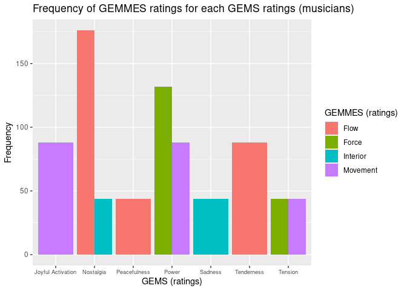
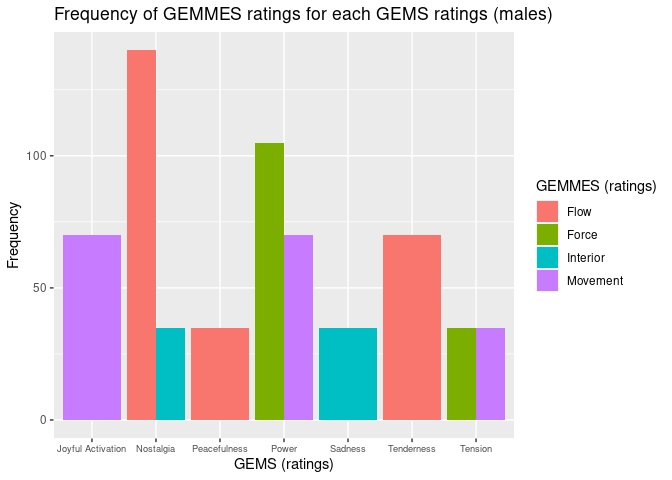
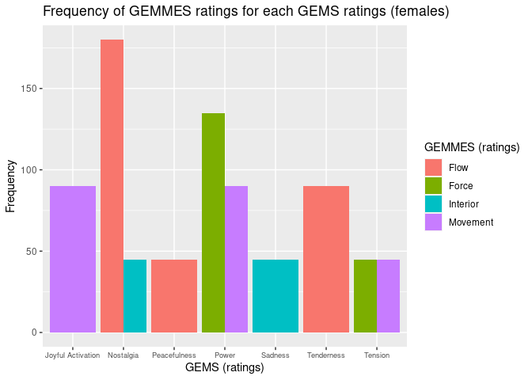

Data Practical 7
================
Stefano Politi
(20 juin 2022)

-   [Importing Data](#importing-data)
-   [Hypothesis](#hypothesis)
-   [Filtering Data](#filtering-data)
-   [Plotting Data](#plotting-data)
-   [Analysing Data](#analysing-data)
-   [References](#references)

Required packages:

``` r
library(readxl)
library(knitr)
library(dplyr)
library(tidyr)
library(ggplot2)
```

## Importing Data

The following dataset is described
[here](https://github.com/StefPo21/IntroDataScience/tree/main/3_data/2_Data.md#Importing-External-Data)
(Dataset 2).

``` r
GEMMES <- read_xlsx("Exp2A-GEMMES_Binomial.xlsx", sheet = 1)
```

The dataset contains multiple copies for each participant. For the
purpose of this practice, the duplicates will be removed.

``` r
GEMMES_clean <- GEMMES %>%
  select(-VISU, -VISU_Value, -VISU_Binomial)
GEMMES_clean <- unique(GEMMES_clean)
```

The dataset contains many variables. For the purpose of this practice,
only a subset will be selected.

``` r
GEMMES2 <- GEMMES_clean %>%
  select(Participant_ID, Sex, Age, Musician_type, Excerpt_id, Excerpt_GEMS, BEST_GEMS, BEST_VA, BEST_VISU)
kable(head(GEMMES2))
```

| Participant_ID    | Sex | Age | Musician_type | Excerpt_id               | Excerpt_GEMS     | BEST_GEMS             | BEST_VA    | BEST_VISU     |
|:------------------|:----|----:|--------------:|:-------------------------|:-----------------|:----------------------|:-----------|:--------------|
| R_10q7ugZebPq8d4x | M   |  28 |             3 | bach_brandenburgconcerto | Sadness          | GEMS_Nostalgia        | VA_Arousal | VISU_Flow     |
| R_10q7ugZebPq8d4x | M   |  28 |             3 | bach_goldberg            | Tenderness       | GEMS_Tenderness       | VA_Valence | VISU_Flow     |
| R_10q7ugZebPq8d4x | M   |  28 |             3 | bach_passacaglia         | Power            | GEMS_Power            | VA_Arousal | VISU_Force    |
| R_10q7ugZebPq8d4x | M   |  28 |             3 | bach_prelude19inamajor   | Peacefulness     | GEMS_Tenderness       | VA_Valence | VISU_Flow     |
| R_10q7ugZebPq8d4x | M   |  28 |             3 | bach_preludeincminor     | Tension          | GEMS_Tension          | VA_Valence | VISU_Movement |
| R_10q7ugZebPq8d4x | M   |  28 |             3 | bach_preludio            | JoyfulActivation | GEMS_JoyfulActivation | VA_Valence | VISU_Movement |

## Hypothesis

Musical expertise and sex should not influence the relationship between
the participant ratings for musical metaphors (GEMMES) and musical
emotions (GEMS).

## Filtering Data

There are no participants classified as musician type 1 (no musical
experience). Type 2 corresponds to non musicians, with a minimum of
musical experience. Type 3 corresponds to musicians, with at least 5
years of regular instrument practice.s

``` r
GEMMES2_types <- GEMMES2 %>%
  count(Musician_type)
kable(GEMMES2_types)
```

| Musician_type |   n |
|--------------:|----:|
|             2 | 648 |
|             3 | 792 |

``` r
GEMMES2_type2 <- GEMMES2 %>%
  filter(Musician_type == 2)
GEMMES2_table2 <- GEMMES2_type2 %>%
  count(var=GEMMES2_type2$BEST_GEMS, wt_var = GEMMES2_type2$BEST_VISU)
kable(GEMMES2_table2)
```

| var                   | wt_var        |   n |
|:----------------------|:--------------|----:|
| GEMS_JoyfulActivation | VISU_Movement |  72 |
| GEMS_Nostalgia        | VISU_Flow     | 144 |
| GEMS_Nostalgia        | VISU_Interior |  36 |
| GEMS_Peacefulness     | VISU_Flow     |  36 |
| GEMS_Power            | VISU_Force    | 108 |
| GEMS_Power            | VISU_Movement |  72 |
| GEMS_Sadness          | VISU_Interior |  36 |
| GEMS_Tenderness       | VISU_Flow     |  72 |
| GEMS_Tension          | VISU_Force    |  36 |
| GEMS_Tension          | VISU_Movement |  36 |

``` r
GEMMES2_type3 <- GEMMES2 %>%
  filter(Musician_type == 3)
GEMMES2_table3 <- GEMMES2_type3 %>%
  count(var=GEMMES2_type3$BEST_GEMS, wt_var = GEMMES2_type3$BEST_VISU)
kable(GEMMES2_table3)
```

| var                   | wt_var        |   n |
|:----------------------|:--------------|----:|
| GEMS_JoyfulActivation | VISU_Movement |  88 |
| GEMS_Nostalgia        | VISU_Flow     | 176 |
| GEMS_Nostalgia        | VISU_Interior |  44 |
| GEMS_Peacefulness     | VISU_Flow     |  44 |
| GEMS_Power            | VISU_Force    | 132 |
| GEMS_Power            | VISU_Movement |  88 |
| GEMS_Sadness          | VISU_Interior |  44 |
| GEMS_Tenderness       | VISU_Flow     |  88 |
| GEMS_Tension          | VISU_Force    |  44 |
| GEMS_Tension          | VISU_Movement |  44 |

``` r
GEMMES2_sexes <- GEMMES2 %>%
  count(Sex)
kable(GEMMES2_sexes)
```

| Sex |   n |
|:----|----:|
| F   | 810 |
| M   | 630 |

``` r
GEMMES2_M <- GEMMES2 %>%
  filter(Sex == "M")
GEMMES2_tableM <- GEMMES2_M %>%
  count(var=GEMMES2_M$BEST_GEMS, wt_var = GEMMES2_M$BEST_VISU)
kable(GEMMES2_tableM)
```

| var                   | wt_var        |   n |
|:----------------------|:--------------|----:|
| GEMS_JoyfulActivation | VISU_Movement |  70 |
| GEMS_Nostalgia        | VISU_Flow     | 140 |
| GEMS_Nostalgia        | VISU_Interior |  35 |
| GEMS_Peacefulness     | VISU_Flow     |  35 |
| GEMS_Power            | VISU_Force    | 105 |
| GEMS_Power            | VISU_Movement |  70 |
| GEMS_Sadness          | VISU_Interior |  35 |
| GEMS_Tenderness       | VISU_Flow     |  70 |
| GEMS_Tension          | VISU_Force    |  35 |
| GEMS_Tension          | VISU_Movement |  35 |

``` r
GEMMES2_F <- GEMMES2 %>%
  filter(Sex == "F")
GEMMES2_tableF <- GEMMES2_F %>%
  count(var=GEMMES2_F$BEST_GEMS, wt_var = GEMMES2_F$BEST_VISU)
kable(GEMMES2_tableF)
```

| var                   | wt_var        |   n |
|:----------------------|:--------------|----:|
| GEMS_JoyfulActivation | VISU_Movement |  90 |
| GEMS_Nostalgia        | VISU_Flow     | 180 |
| GEMS_Nostalgia        | VISU_Interior |  45 |
| GEMS_Peacefulness     | VISU_Flow     |  45 |
| GEMS_Power            | VISU_Force    | 135 |
| GEMS_Power            | VISU_Movement |  90 |
| GEMS_Sadness          | VISU_Interior |  45 |
| GEMS_Tenderness       | VISU_Flow     |  90 |
| GEMS_Tension          | VISU_Force    |  45 |
| GEMS_Tension          | VISU_Movement |  45 |

## Plotting Data

The grouped bar-plots for both musician types seem identical.

``` r
ggplot(GEMMES2_table2, aes(x=var, y=n, fill = wt_var))+
  geom_bar(position='dodge', stat='identity')+
  theme(axis.text.x = element_text(size = 7))+
  scale_x_discrete(labels = c("Joyful Activation", "Nostalgia", "Peacefulness", "Power", "Sadness", "Tenderness", "Tension"))+
  labs(title = "Frequency of GEMMES ratings for each GEMS ratings (non-musicians)", x="GEMS (ratings)", y="Frequency", fill = "GEMMES (ratings)")+
  scale_fill_discrete(labels = c("Flow", "Force", "Interior", "Movement"))
```

<!-- -->

``` r
ggplot(GEMMES2_table3, aes(x=var, y=n, fill = wt_var))+
  geom_bar(position='dodge', stat='identity')+
  theme(axis.text.x = element_text(size = 7))+
  scale_x_discrete(labels = c("Joyful Activation", "Nostalgia", "Peacefulness", "Power", "Sadness", "Tenderness", "Tension"))+
  labs(title = "Frequency of GEMMES ratings for each GEMS ratings (musicians)", x="GEMS (ratings)", y="Frequency", fill = "GEMMES (ratings)")+
  scale_fill_discrete(labels = c("Flow", "Force", "Interior", "Movement"))
```

<!-- -->

The grouped bar-plots for both sexes seem identical.

``` r
ggplot(GEMMES2_tableM, aes(x=var, y=n, fill = wt_var))+
  geom_bar(position='dodge', stat='identity')+
  theme(axis.text.x = element_text(size = 7))+
  scale_x_discrete(labels = c("Joyful Activation", "Nostalgia", "Peacefulness", "Power", "Sadness", "Tenderness", "Tension"))+
  labs(title = "Frequency of GEMMES ratings for each GEMS ratings (males)", x="GEMS (ratings)", y="Frequency", fill = "GEMMES (ratings)")+
  scale_fill_discrete(labels = c("Flow", "Force", "Interior", "Movement"))
```

<!-- -->

``` r
ggplot(GEMMES2_tableF, aes(x=var, y=n, fill = wt_var))+
  geom_bar(position='dodge', stat='identity')+
  theme(axis.text.x = element_text(size = 7))+
  scale_x_discrete(labels = c("Joyful Activation", "Nostalgia", "Peacefulness", "Power", "Sadness", "Tenderness", "Tension"))+
  labs(title = "Frequency of GEMMES ratings for each GEMS ratings (females)", x="GEMS (ratings)", y="Frequency", fill = "GEMMES (ratings)")+
  scale_fill_discrete(labels = c("Flow", "Force", "Interior", "Movement"))
```

<!-- -->

## Analysing Data

Proportion test could be useful to analyse the data, however I did not
manage to properly do such tests…

## References

Schaerlaeken, S., Glowinski, D., & Grandjean, D. (2022). Linking musical
metaphors and emotions evoked by the sound of classical music.
*Psychology of music*, 50(1), 245-264.
