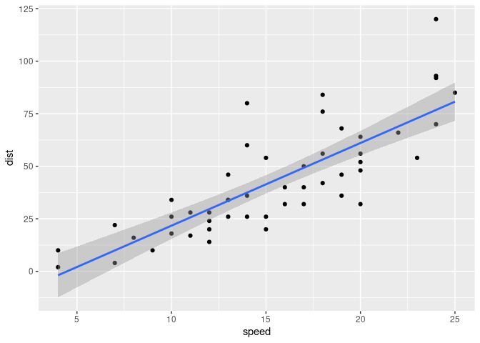

Data Practical 8
================
Stefano Politi
(20 juin 2022)

-   [Importing Data](#importing-data)
-   [Linear model](#linear-model)
-   [Plot](#plot)

Required packages:

``` r
library(tidyr)
library(knitr)
library(dslabs)
library(ggplot2)
```

## Importing Data

The
[cars](https://www.rdocumentation.org/packages/datasets/versions/3.6.2/topics/cars)
dataset shows the speed of the cars and distances taken to stop (note
that the data were recorded in the 1920).

``` r
data("cars")
kable(head(cars))
```

| speed | dist |
|------:|-----:|
|     4 |    2 |
|     4 |   10 |
|     7 |    4 |
|     7 |   22 |
|     8 |   16 |
|     9 |   10 |

The dataset is composed of 50 observations for 2 variables: \*
Explanatory variable: speed (numeric: quantitative, continuous). \*
Response variable: dist (numeric: quantitative, continuous).

``` r
str(cars)
```

    ## 'data.frame':    50 obs. of  2 variables:
    ##  $ speed: num  4 4 7 7 8 9 10 10 10 11 ...
    ##  $ dist : num  2 10 4 22 16 10 18 26 34 17 ...

## Linear model

There is a high correlation between the 2 variables (r = 0.8) and the
p-value is significant (p = 0.01).

``` r
cor.test(cars$speed, cars$dist)
```

    ## 
    ##  Pearson's product-moment correlation
    ## 
    ## data:  cars$speed and cars$dist
    ## t = 9.464, df = 48, p-value = 1.49e-12
    ## alternative hypothesis: true correlation is not equal to 0
    ## 95 percent confidence interval:
    ##  0.6816422 0.8862036
    ## sample estimates:
    ##       cor 
    ## 0.8068949

``` r
model<-lm( dist ~speed, data= cars)
summary(model)
```

    ## 
    ## Call:
    ## lm(formula = dist ~ speed, data = cars)
    ## 
    ## Residuals:
    ##     Min      1Q  Median      3Q     Max 
    ## -29.069  -9.525  -2.272   9.215  43.201 
    ## 
    ## Coefficients:
    ##             Estimate Std. Error t value Pr(>|t|)    
    ## (Intercept) -17.5791     6.7584  -2.601   0.0123 *  
    ## speed         3.9324     0.4155   9.464 1.49e-12 ***
    ## ---
    ## Signif. codes:  0 '***' 0.001 '**' 0.01 '*' 0.05 '.' 0.1 ' ' 1
    ## 
    ## Residual standard error: 15.38 on 48 degrees of freedom
    ## Multiple R-squared:  0.6511, Adjusted R-squared:  0.6438 
    ## F-statistic: 89.57 on 1 and 48 DF,  p-value: 1.49e-12

## Plot

The plot clearly shows an increase in the distance to stop as the speed
increases.

``` r
ggplot(cars, aes(speed, dist)) +
  geom_point() +
  geom_smooth(method = "lm")
```

<!-- -->
